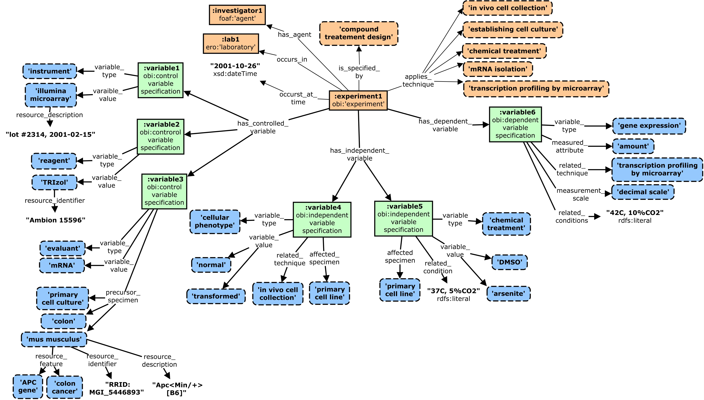

# experimental-metadata
*A framework for a simple, domain-independent, and extensible experimental metadata model.*

This repository holds artifacts related to the specification of a simple, domain-independent, and extensible experimental metadata model for describing research objects (ROs) such as datasets, protocols, experimental records, and publications. 
This work is in its **early stages**. The documents contained here present our environmental scan to identify and evaluate related efforts, describe requirements analysis and use cases that informed our model, and document initial straw-man modeling proposals. More formally defined models and documentation are to come, but at present the best place to start is to review the docs in this repository:

* The **slide deck [here](https://github.com/OHSU-Ontology-Development-Group/experimental-metadata/blob/master/docs/6-18-15%20Experimental%20Metadata%20Concepts%20and%20Models.pptx?raw=true)** gives an overview of our work to date.
* The **document [here](https://github.com/OHSU-Ontology-Development-Group/experimental-metadata/blob/master/docs/CoreConceptsforExperimentalMetadataModel_v1.docx?raw=true)** goes into greater detail about certain aspects of the work (e.g. the core concept glossary). 
* The **spreadsheets [here](https://github.com/OHSU-Ontology-Development-Group/experimental-metadata/blob/master/docs/Landscape%20Analysis.xlsx?raw=true)** contain some of the initial landscape analysis efforts we performed to inform our work.

In these efforts we are clear to distinguish the notion of **general metadata**, which describes attributes of a research object itself, from that of **experimental metadata**, which describes an experiment related to the research object. There are many well established standards in place to describe general metadata (e.g. [DC](http://dublincore.org/), [DCAT](http://www.w3.org/TR/vocab-dcat/), [PROV](http://www.w3.org/TR/prov-o/)), and recommendations about how to apply these (e.g. the [HCLS Dataset Description Standard](http://www.w3.org/2001/sw/hcls/notes/hcls-dataset/) ). The greater and more pressing challenge is to similarly define standards around capturing experimental metadata - which describes how entities such as **techniques**, **specimens**, and **variables** are applied in an experiment that generated a dataset.

-------------------------

**Initial Strawman Model:** *As illustrated with metadata for an exemplar experiment that used transcriptional profiling by microarray to explore AKT-dependent stress response pathways in transformed  adenocarcinoma cells vs healthy epithelial cells.*

 
